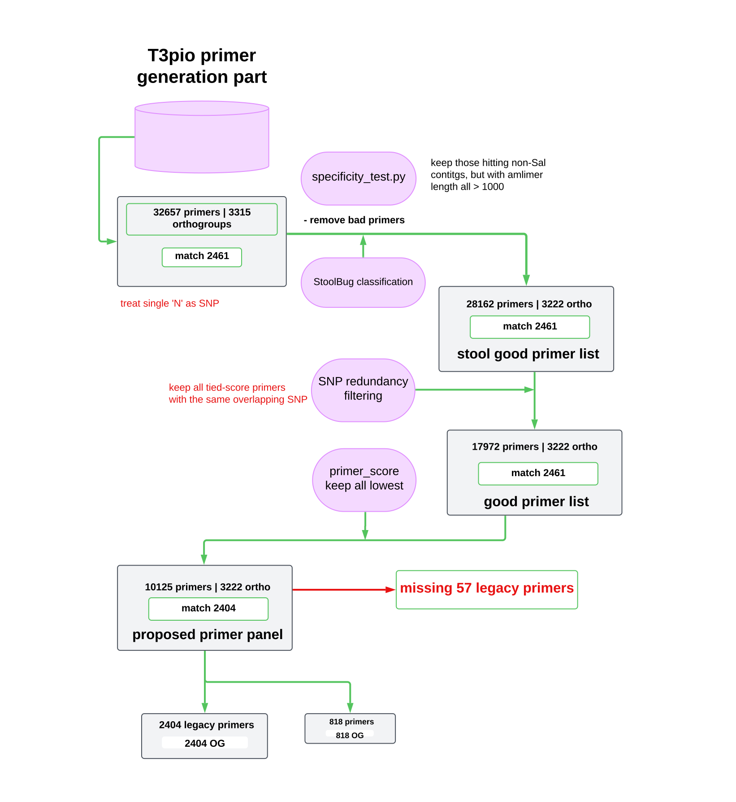

[](https://github.com/uel3/t3pio/actions?query=workflow%3A%22nf-core+CI%22)
[](https://github.com/uel3/t3pio/actions?query=workflow%3A%22nf-core+linting%22)[](https://doi.org/10.5281/zenodo.XXXXXXX)

[](https://www.nextflow.io/)
[](https://docs.conda.io/en/latest/)
[](https://www.docker.com/)
[](https://sylabs.io/docs/)
[](https://tower.nf/launch?pipeline=https://github.com/uel3/t3pio)

## Introduction

**uel3/t3pio** is adapted from T3Pio which is an amplicon generation pipeline built for designing direct from stool amplicon sets for HMAS schemes

## Description

**uel3/t3pio** takes as input annotated genomes from the bacterial species of interest. Core genes from the species are identified and primers are designed to generate amplicons compatible with the user’s chosen HMAS platform. Current settings allow up to 3 degenerate bases per 180-250 bp primer.
<!-- TODO nf-core:
   Complete this sentence with a 2-3 sentence summary of what types of data the pipeline ingests, a brief overview of the
   major pipeline sections and the types of output it produces. You're giving an overview to someone new
   to nf-core here, in 15-20 seconds. For an example, see https://github.com/nf-core/rnaseq/blob/master/README.md#introduction
-->

<!-- TODO nf-core: Include a figure that guides the user through the major workflow steps. Many nf-core
     workflows use the "tube map" design for that. See https://nf-co.re/docs/contributing/design_guidelines#examples for examples.   -->
<!-- TODO nf-core: Fill in short bullet-pointed list of the default steps in the pipeline -->

1. Python3 
2. OrthoFinder (v2.1.2)
3. MUSCLE (v3.8.1)
4. TrimAl (v1.2)
5. EMBOSS consambig (v.6.4.0)
6. Primer3 (2.3.4)
7. EMBOSS primersearch (v6.4.0)


## Usage

Running T3pio requires Nextflow (>=21.10.3) and singulairity to be installed. There are detailed instructions below for Nextflow installation, including Nextflow's Bash and Java requirements. Currently, all required dependencies—except for Nextflow—are provided through Docker and Singularity images .
> [!NOTE]
> If you are new to Nextflow and nf-core, please refer to [this page](https://nf-co.re/docs/usage/installation) on how to set-up Nextflow. Make sure to [test your setup](https://nf-co.re/docs/usage/introduction#how-to-run-a-pipeline) with `-profile test` before running the workflow on actual data.


After Nextflow is installed, clone the pipeline:  
```bash
git clone https://github.com/uel3/uel3-t3pio  
```

<!-- TODO nf-core: Describe the minimum required steps to execute the pipeline, e.g. how to prepare samplesheets.
     Explain what rows and columns represent. For instance (please edit as appropriate):

First, prepare a samplesheet with your input data that looks as follows:

`samplesheet.csv`:

```csv
sample,fastq_1,fastq_2
CONTROL_REP1,AEG588A1_S1_L002_R1_001.fastq.gz,AEG588A1_S1_L002_R2_001.fastq.gz
```

Each row represents a fastq file (single-end) or a pair of fastq files (paired end).

-->

Now, you can run the pipeline using:

<!-- TODO nf-core: update the following command to include all required parameters for a minimal example -->

```bash
nextflow run main.nf \
   -profile singularity,t3pio_docker \
   --input <path/to/gbk/files>(input genomes, in gbk format) \
   --contig_file <path/to/contig_file(for filtering, fasta format)> \
   --outdir <OUTDIR> \
   --good_contig_list <path/to/good_contig_list_file(for filtering)> \
   --run_compare_primers (either true or false) \
   --number_isolates (the number of isolates to be included in an orthogroup) \
```
**note:** if either ```contig_file``` or ```good_contig_list``` is omitted, the pipeline will skip the filtering step, but will still proceed to generate the primer pool using the Primer3 process.    

To run, test against existing MLST primers, turn on the legacy_file_path process and provide the path to existing MLST primers file from the CLI or in the nextflow.config as legacy_file_path:

```bash
nextflow run uel3/t3pio \
   -profile <docker/singularity/.../institute> \
   --run_compare_primers true \
   --legacy_file_path <path/to/existing/MLST/primers/file> \
   --input <path/to/gbk/files> \
   --outdir <OUTDIR>
```
Add the flowchart for the filtering part of the `t3pio` pipeline.  

<p align="center"></p>   

## Primer Filtering Summary

In the `primers` folder of the output directory, you will find 5 files representing the primer lists at different stages of the filtering process:

- `concatenated_primers_primer3.txt` — raw primer pool generated by Primer3  
- `concatenated_primers_specificity.txt` — after specificity testing using JSB data  
- `concatenated_primers_snpfiltered.txt` — after SNP redundancy filtering  
- `concatenated_primers_final.txt` — after primer-score filtering (retaining all lowest score primers in each orthogroup)  
- `concatenated_primers_final_firstrow.txt` — after primer-score filtering (keeping only the first lowest score primer in each orthogroup)  

To summarize these files, run the following one-liner script inside the `primers` folder. It will output the **legacy primer match count**, **unique oligo group count**, and **total primer count** for each file—all on a single line per file:

```bash
for file in concatenated_primers_*; do awk -v fname="$file" 'NR==FNR {seen[$1]; next} ($4 in seen) {count++} END {printf "%s: legacy_primer match = %d, ", fname, count}' "$file" /scicomp/groups/OID/NCEZID/DFWED/EDLB/projects/CIMS/HMAS_pilot/step_mothur/HMAS-QC-Pipeline2/Sal_v1.0.oligo; cut -f1 "$file" | cut -f1 -d 'p' | sort | uniq | wc -l | awk '{printf "oligo group = %d, ", $1}'; wc -l < "$file" | awk '{printf "total primer count = %d\n", $1}'; done  
```  


> [!WARNING]
> Please provide pipeline parameters via the CLI or Nextflow `-params-file` option. Custom config files including those provided by the `-c` Nextflow option can be used to provide any configuration _**except for parameters**_;
> see [docs](https://nf-co.re/usage/configuration#custom-configuration-files).

## Credits

uel3/t3pio was originally written by AJ Williams-Newkirk, S Lucking, R Jin, and adapted to nextflow by C Cole and R Jin. 

We thank the following people for their extensive assistance in the development of this pipeline:

<!-- TODO nf-core: If applicable, make list of people who have also contributed -->

## Contributions and Support

If you would like to contribute to this pipeline, please see the [contributing guidelines](.github/CONTRIBUTING.md).

## Citations

<!-- TODO nf-core: Add citation for pipeline after first release. Uncomment lines below and update Zenodo doi and badge at the top of this file. -->
<!-- If you use uel3/t3pio for your analysis, please cite it using the following doi: [10.5281/zenodo.XXXXXX](https://doi.org/10.5281/zenodo.XXXXXX) -->

<!-- TODO nf-core: Add bibliography of tools and data used in your pipeline -->

An extensive list of references for the tools used by the pipeline can be found in the [`CITATIONS.md`](CITATIONS.md) file.

This pipeline uses code and infrastructure developed and maintained by the [nf-core](https://nf-co.re) community, reused here under the [MIT license](https://github.com/nf-core/tools/blob/master/LICENSE).

> **The nf-core framework for community-curated bioinformatics pipelines.**
>
> Philip Ewels, Alexander Peltzer, Sven Fillinger, Harshil Patel, Johannes Alneberg, Andreas Wilm, Maxime Ulysse Garcia, Paolo Di Tommaso & Sven Nahnsen.
>
> _Nat Biotechnol._ 2020 Feb 13. doi: [10.1038/s41587-020-0439-x](https://dx.doi.org/10.1038/s41587-020-0439-x).
